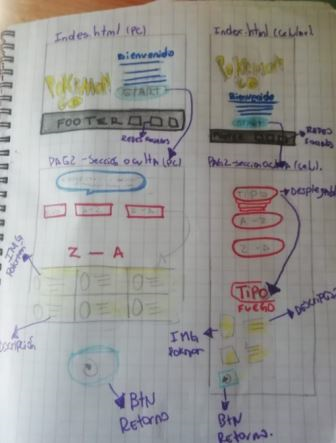

# POKEDATA GO

## Índice

* [1. Definición del producto](#1-definición-del-producto)
* [2. Encuesta](#2-encuesta)
* [3. Prototipos](#3-prototipos)
* [4. Historias de usuario](#4-historias-de-usuario)
* [5. Interfaz de usuario](#5-interfaz-de-usuario)

***

## 1. Definición del producto

Pokémon GO es uno de los juegos más populares de los últimos años. Éste permite a los usuarios convertirse en entrenadores/maestros Pokémon y realizar diversas actividades, como encontrar distintos Pokémon en los sitios que visiten, atraparlos para completar su Pokédex y pelear en épicos combates contra otros entrenadores.

Nuestro proyecto PokéData GO surge como un complemento para los fanáticos de Pokémon GO, en el cual pueden conocer ciertas características de los 251 Pokémon de las generaciones Kanto y Johto. Además de mostrar esta información, la página permite al usuario ordenar alfabéticamente, filtrar por tipo y buscar Pokémon por caracteres, de modo tal que pueden encontrarlos de forma rápida.

## 2. Encuesta

Nuestro punto de partida para empezar el proyecto fue realizar una encuesta de 6 preguntas entre personas fanáticas de la serie y del juego. Diseñamos la encuesta en Google Form, la difundimos y recibimos un total de 23 respuestas.

Los resultados de la encuesta son los siguientes:

## 3. Prototipos

Con los resultados obtenidos en la encuesta, procedimos a crear nuestros primeros prototipos en papel y lápiz:

Posteriormente, creamos este prototipo de alta fidelidad en Figma, considerando tres tamaños distintos de pantallas (computador, teléfono móvil y tablet):

El prototipo en Figma puede verse en el siguiente link:

[Figma PokeData GO](https://www.figma.com/file/HnR4YZEl3iGE4VGuPHxy5i/Data-Lovers---Pokemon?node-id=0%3A1)

## 4. Historias de usuario

Trabajamos con **cuatro** historias de usuario para ir desarrollando la interfaz de usuario de nuestro proyecto:

## 5. Interfaz de usuario

Los criterios para considerar que has realizado este proyecto son:
