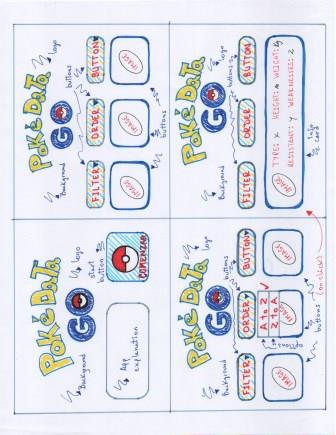

# POKEDATA GO

## Índice

* [1. Definición del producto](#1-definición-del-producto)
* [2. Encuesta](#2-encuesta)
* [3. Prototipos](#3-prototipos)
* [4. Tests de usabilidad](#4-tests-de-usabilidad)
* [5. Historias de usuario](#5-historias-de-usuario)
* [6. Interfaz final de usuario](#6-interfaz-de-usuario)

***

## 1. Definición del producto

Pokémon GO es uno de los juegos más populares de los últimos años. Éste permite a los usuarios convertirse en entrenadores/maestros Pokémon y realizar diversas actividades, como encontrar distintos Pokémon en los sitios que visiten, atraparlos para completar su Pokédex y pelear en épicos combates contra otros entrenadores.

Nuestro proyecto PokéData GO surge como un complemento para los fanáticos de Pokémon GO, en el cual pueden conocer ciertas características de los 251 Pokémon de las generaciones Kanto y Johto. Además de mostrar esta información, la página permite al usuario ordenar alfabéticamente, filtrar por tipo y buscar Pokémon por caracteres, de modo tal que pueden encontrarlos de forma rápida.

## 2. Encuesta

Nuestro punto de partida para empezar el proyecto fue realizar una encuesta de 6 preguntas entre personas fanáticas de la serie y del juego. Diseñamos la encuesta en Google Form, la difundimos y recibimos un total de 23 respuestas.

Los resultados de la encuesta son los siguientes:

## 3. Prototipos

Decidimos usar un esquema de colores alusivos a la serie Pokémon y al juego Pokémon GO, para mantener la uniformidad en todo nuestro proyecto:

Con los resultados obtenidos en la encuesta, procedimos a crear nuestros primeros prototipos en papel y lápiz:

Posteriormente, creamos este prototipo de alta fidelidad en Figma, considerando tres tamaños distintos de pantallas (computador, teléfono móvil y tablet):

Nuestro prototipo en Figma puede verse en el siguiente link:

[Figma PokeData GO](https://www.figma.com/file/HnR4YZEl3iGE4VGuPHxy5i/Data-Lovers---Pokemon?node-id=0%3A1)

## 4. Tests de usabilidad

A lo largo de nuestro proceso de diseño y desarrollo, realizamos tests de usabilidad para mejorar el diseño y la interacción con la página, realizando diversas modificaciones que se reflejaron en nuestro resultado final, como ser:

a) Cambiar el botón de retorno, de una flecha apuntando hacia arriba a una casa, para que sea más intuitivo.

b) Suavizar el tono de amarillo utilizado en el fondo de las tarjetas con los personajes, para que el color no sea cansador a la vista y permita que las imágenes de cada Pokémon se destaquen.

c) Mejorar la jerarquía en los textos que contienen la información de cada Pokémon, utilizando letras mayúsculas para sus nombres y minúsculas para otros datos.

## 5. Historias de usuario

Trabajamos con **cuatro** historias de usuario para desarrollar la interfaz de usuario de nuestro proyecto:

## 6. Interfaz de usuario

Finalmente, éste es el resultado final de nuestro proyecto, el cual contiene todo el proceso de diseño UX y desarrollo que realizamos a lo largo de cinco semanas, junto con el *feedback* que recibimos de nuestros coaches de Laboratoria, compañeras de generación y otros usuarios externos:

[PokeData GO](https://cecyramallo.github.io/SCL015-data-lovers/src/)
